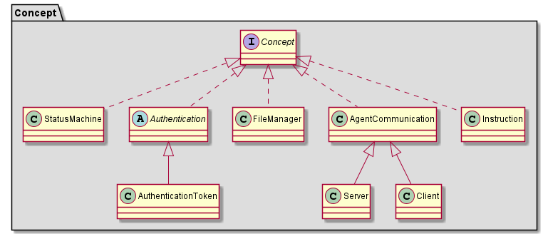
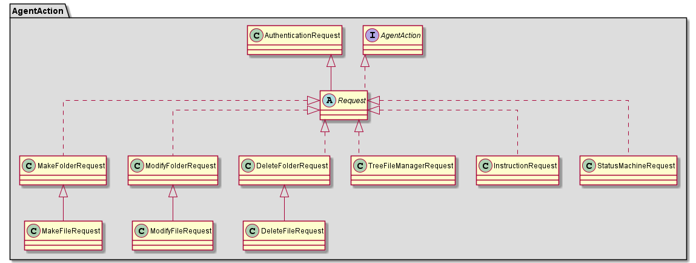
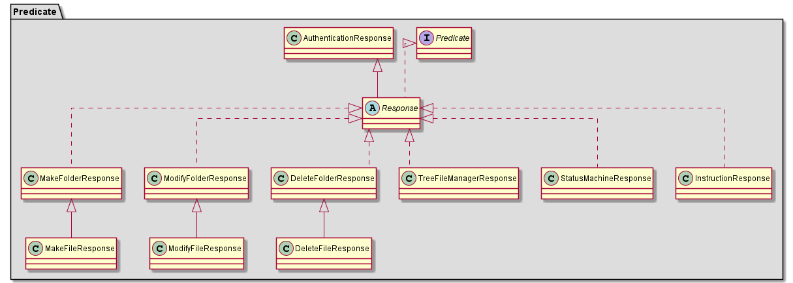

# THUMDER Ontology

| Command         | Description                                              |
| ----------------- | ---------------------------------------------------------- |
| `npm run build` | Build the app. Your built files are in the /dist folder. |
| `npm run start` | Execute the app with`/dist` folder                      |
| `npm run jest`  | Test the app                                             |

### Concept

### AgentAction

### Predicate

### Assets

